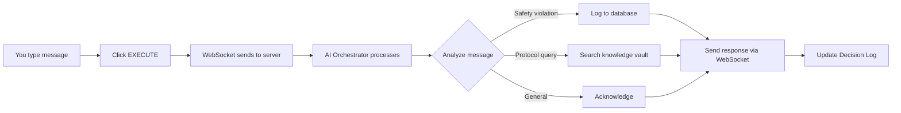

# 🚀 AEGIS User Guide - Getting Started in 5 Minutes

Welcome to **AEGIS** - your AI-powered safety monitoring assistant! This guide will help you get started quickly.

---

## 📋 What You'll Need

- ✅ Python 3.10 or newer installed on your computer
- ✅ 5 minutes of your time
- ✅ A web browser (Chrome, Firefox, Edge, etc.)

---

## 🎯 Step 1: Start the Application

### If the server is already running:
Great! You can skip to **Step 2** below. Just open your browser and go to:
```
http://localhost:8000
```

### If you need to start it:

**Open your terminal/command prompt** and navigate to the project folder:

```bash
# Windows
cd C:\Users\RAJ SINGH\OneDrive\Desktop\geminihackethon

# Activate the virtual environment
venv\Scripts\activate

# Start the server
python manage.py runserver
```

You should see:
```
Starting development server at http://127.0.0.1:8000/
```

✅ **Success!** Your server is running.

---

## 🖥️ Step 2: Open the Dashboard

1. **Open your web browser**
2. **Go to:** `http://localhost:8000`
3. You'll see the **AEGIS Dashboard** - a dark-themed control panel

### What You'll See:

```
┌─────────────────────────────────────────────────────────┐
│  AEGIS // SENTINEL CORE          ● SYSTEM ONLINE        │
├─────────────────────────────────────────────────────────┤
│                                                          │
│  📊 System Stats    │  🎥 Live Feed                     │
│  ─────────────────  │  ───────────────                  │
│  Model Context      │  [Video placeholder]              │
│  Latency: 12ms      │                                   │
│  Deviations: 03     │  Input: [Type here...]  EXECUTE   │
│                     │                                   │
│  Active Policies    │  📝 Decision Log                  │
│  ─────────────────  │  ─────────────────                │
│  ✓ SURGICAL_SAFETY  │  [Real-time AI decisions]         │
│  ✓ STERILE_FIELD    │                                   │
│                     │                                   │
└─────────────────────────────────────────────────────────┘
```

---

## 🎮 Step 3: Try It Out!

### Test the AI Safety Monitor

At the bottom of the main panel, you'll see an input field that says:
```
>> INJECT SIMULATION EVENT...
```

**Try these examples:**

#### Example 1: Detect a Safety Violation
Type this and click **EXECUTE**:
```
unsafe instrument detected in sterile field
```

**What happens:**
- 🤖 AI analyzes the event
- 🚨 Logs a **HIGH severity** deviation
- 📝 Shows the decision in the log
- 💾 Saves to database

#### Example 2: Search Safety Protocols
Type this and click **EXECUTE**:
```
check protocol for sterile field procedures
```

**What happens:**
- 🔍 AI searches the knowledge vault
- 📚 Returns relevant safety protocols
- 📝 Displays results in the log

#### Example 3: General Monitoring
Type this and click **EXECUTE**:
```
monitoring surgical procedure room 3
```

**What happens:**
- ✅ AI acknowledges the monitoring request
- 👁️ Shows it's actively watching
- 📝 Logs the activity

---

## 📊 Understanding the Dashboard

### Left Sidebar - System Status

**Model Context**
- Shows how much of the 2M token AI memory is being used
- Like RAM for the AI's brain

**Latency**
- How fast the AI responds (12ms = super fast!)

**Deviations (24h)**
- Number of safety issues detected today

**Active Policies**
- Which safety rules are being monitored

### Center Panel - Live Feed

**Video Stream Area**
- Currently shows a placeholder
- In production, this would show live camera feed

**Simulation Input**
- Where you type test events
- Click **EXECUTE** to send

### Right Panel - Decision Log

**Real-time Updates**
- Every AI decision appears here
- Color-coded by severity:
  - 🟢 Green = Info
  - 🟡 Yellow = Warning  
  - 🔴 Red = Critical

**Thought Signatures**
- Shows the AI's reasoning process
- Helps understand why decisions were made

---

## 🎯 Common Use Cases

### 1. Testing Safety Detection

**Scenario:** You want to see if the AI detects unsafe conditions

**Steps:**
1. Type: `"violation: ungloved hand near surgical site"`
2. Click **EXECUTE**
3. Watch the Decision Log for the AI's response
4. Check that it logged as HIGH severity

### 2. Looking Up Protocols

**Scenario:** You need to check a safety procedure

**Steps:**
1. Type: `"protocol for anesthesia monitoring"`
2. Click **EXECUTE**
3. Read the protocol information in the log

### 3. Continuous Monitoring

**Scenario:** You want to simulate ongoing monitoring

**Steps:**
1. Type: `"begin monitoring operating room"`
2. Click **EXECUTE**
3. Send periodic updates like:
   - `"patient vitals stable"`
   - `"equipment check complete"`
   - `"procedure progressing normally"`

---

## 🔍 Viewing Logged Deviations

### Option 1: Dashboard Log
- All recent decisions appear in the **Decision Log** panel
- Newest entries appear at the top

### Option 2: Admin Panel

1. Go to: `http://localhost:8000/admin/`
2. Login with your superuser credentials
3. Click **Analytics** → **Deviations**
4. See all logged safety violations with:
   - Timestamp
   - Severity level
   - Description
   - Recommended actions

**Don't have admin access?** Create a superuser:
```bash
python manage.py createsuperuser
```

---

## 💡 Pro Tips

### Tip 1: Watch the WebSocket Status
Look for **"CONNECTED"** in green at the top-right
- ✅ Green = Real-time connection active
- 🔴 Red = Connection lost (refresh the page)

### Tip 2: Use Specific Keywords
The AI responds to certain keywords:
- `"unsafe"`, `"violation"` → Triggers deviation logging
- `"protocol"`, `"procedure"` → Searches knowledge vault
- Anything else → General monitoring

### Tip 3: Check Browser Console
Press **F12** to open Developer Tools
- Go to **Console** tab to see connection status
- Go to **Network** → **WS** to see WebSocket messages

### Tip 4: Multiple Tabs
You can open multiple browser tabs to the dashboard
- Each gets its own WebSocket connection
- Great for testing multi-user scenarios

---

## 🛠️ Troubleshooting

### Problem: Dashboard won't load

**Solution:**
1. Check if the server is running
2. Look for this message in terminal:
   ```
   Starting development server at http://127.0.0.1:8000/
   ```
3. If not running, start it:
   ```bash
   python manage.py runserver
   ```

### Problem: Styles look broken

**Solution:**
1. Hard refresh the page: **Ctrl + Shift + R** (Windows) or **Cmd + Shift + R** (Mac)
2. Check browser console for errors (F12)

### Problem: WebSocket shows "OFFLINE"

**Solution:**
1. Refresh the page
2. Check that the server is running
3. Make sure you're using `http://localhost:8000` (not `127.0.0.1`)

### Problem: Nothing happens when I click EXECUTE

**Solution:**
1. Open browser console (F12)
2. Look for JavaScript errors
3. Check that the input field has text
4. Verify WebSocket is connected (green status)

---

## 🎓 What's Happening Behind the Scenes?

When you send a message:



1. **Your Input** → Sent via WebSocket (real-time connection)
2. **AI Processing** → Gemini-powered reasoning engine analyzes it
3. **Tool Execution** → Logs deviations or searches protocols
4. **Response** → Sent back instantly via WebSocket
5. **UI Update** → Decision Log shows the result

---

## 🚀 Next Steps

### Ready for More?

1. **Explore the Admin Panel**
   - View all logged deviations
   - See database records
   - Manage users

2. **Read the Technical Docs**
   - Check out [README.md](file:///c:/Users/RAJ%20SINGH/OneDrive/Desktop/geminihackethon/README.md)
   - Review [Product Overview](file:///C:/Users/RAJ%20SINGH/.gemini/antigravity/brain/7b037f25-b335-4e0b-87e9-e59ca094cc04/product_overview.md)

3. **Customize for Your Use Case**
   - Modify safety policies in `core_auditor/services/tools.py`
   - Add new protocols to the knowledge vault
   - Integrate with real cameras/sensors

---

## 📞 Need Help?

- **Check the logs:** Look at the terminal where the server is running
- **Browser console:** Press F12 to see JavaScript errors
- **Django admin:** Go to `/admin/` to inspect the database

---

## 🎉 You're All Set!

You now know how to:
- ✅ Start the AEGIS application
- ✅ Navigate the dashboard
- ✅ Test safety monitoring
- ✅ View logged deviations
- ✅ Troubleshoot common issues

**Happy monitoring!** 🛡️

---

*Built with Django + Google Gemini | Real-time AI Safety Monitoring*
